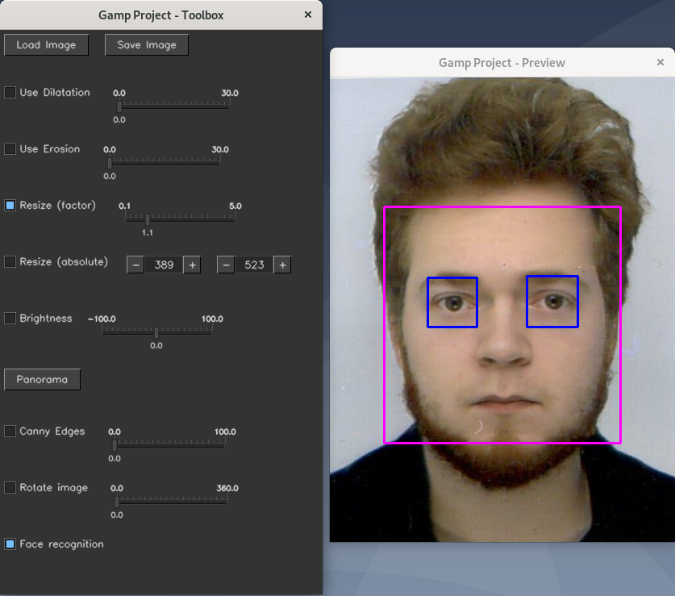

<h1 align="center">
  <br>
  
</h1>

<h4 align="center">
Gamp project - Multimedia Application Final Project</h4>

<p align="center">
  <a href="https://github.com/arcreane/gimpisep-x3r0/releases/latest"></a>
  <a href="https://github.com/arcreane/gimpisep-x3r0/issues">
    
  </a>
  <a href="https://github.com/arcreane/gimpisep-x3r0/pulls">
    
  </a>
  
</p>

<p align="center">
  <a href="#about">About</a> •
  <a href="#how-to-build">How to build</a> •
  <a href="#authors">Authors</a> •
  <a href="#license">License</a>
</p>

## About

Gamp is a school project in the "Multimedia Application" module where the goal is to reproduce a semblance of the well-known GIMP project.

The objective of this project is to learn how to use the OpenCV library through the example of a concrete case. For this project, we have been asked to implement the different functionalities below:

* [x] Dilatation / Erosion
* [x] Resizing
* [x] Lighten / Darken
* [x] Panorama / Stitching
* [x] Canny edge detection
* [x] Image rotation
* [x] Face recognition

<h1 align="center">
  <br>
  
</h1>

## How to build

### On Linux

To compile and use Gamp, you must first install OpenCV and all necessary dependencies. For this purpose an `install_opencv.sh` file is available and its role is to install everything properly.

```bash
$ sudo ./install_opencv.sh

or

$ sudo make install_opencv
```

Once opencv and the dependencies are installed, you just have to compile the project:

```bash
$ make all
```

The makefile offers several commands for development:
```bash
// To remove all .o files
$ make clean

// To remove all .o files and the final executable
$ make fclean

// To clean all files and recompile:
$ make re
```

Once the project is compiled, simply go to the `build/` folder and launch Gamp:
```bash
$ cd build/
$ ./gamp
```

### On Windows

You must first install OpenCV, we recommend to have at least version 4.5.X. You can download it [on this link](https://opencv.org/releases/), make sure to install it preferably in `C:\opencv`, or don't forget to modify the project configurations to point in the right path.

You will also need [Visual Studio](https://visualstudio.microsoft.com/fr/), version 2019 or higher is recommended. Then you just have to open the solution contained in the `Gamp/` folder and you can compile.

**Note**: Make sure you compile for an x64 architecture and in release mode!

## Authors

| Name              | Github                                              |
|-------------------|-----------------------------------------------------|
| Yohann MARTIN     | [Astropilot](https://github.com/Astropilot)         |
| Mathias GEROUDET  | [Sazere](https://github.com/Sazere)                 |
| Timothee PIONNIER | [TimPionnier](https://github.com/TimPionnier)       |
| Oscar Mc Auliffe  | [oscarmcauliffe](https://github.com/oscarmcauliffe) |

## License

MIT - See LICENSE file
